# LIC2023-Video-Semantic-Understanding-Baseline
Classifying the closed two-level label system according to the video content, obtaining the classification label that describes the video.

该项目为👉 [LIC2023视频语义理解技术评测任务](https://aistudio.baidu.com/aistudio/competition/detail/160/0/introduction)👈 的快速启动版基准模型，项目基于[github基线](https://github.com/PaddlePaddle/Research/tree/master/KG/DuKEVU_Baseline)改造，为选手提供了存储和算力支持。模型包括两部分：1）视频分类标签模型 paddle-video-classify-tag；2）视频语义标签模型 paddle-video-semantic-tag。

视频分类标签模型根据视频内容在封闭的二级标签体系上进行分类，得到描述视频的分类标签；视频语义标签模型从视频的文本信息中抽取实体语义标签（选手可进行升级，如利用给定的知识库进行推理、融合多模信息提升标签理解效果，或生成标签等）。两部分模型产出的标签结果，分别对应技术评测标签中的分类标签、语义标签。

 

## 运行结果

| No   | Steps | Result                                                       |
| :----: | :------------------------------------------------------------: | :-------: |
| 1 | **环境搭建** | 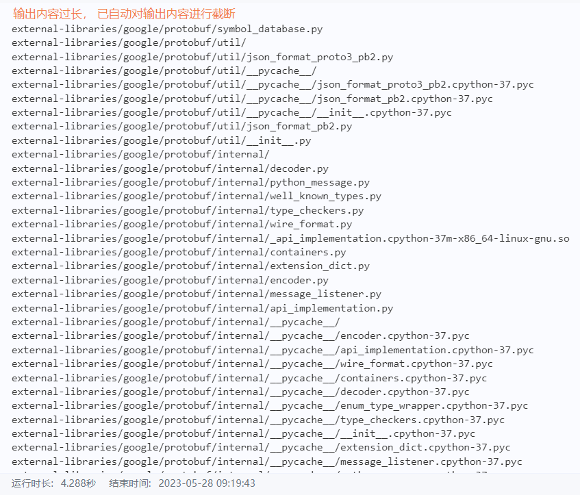 |
| 2    | **数据加载** | 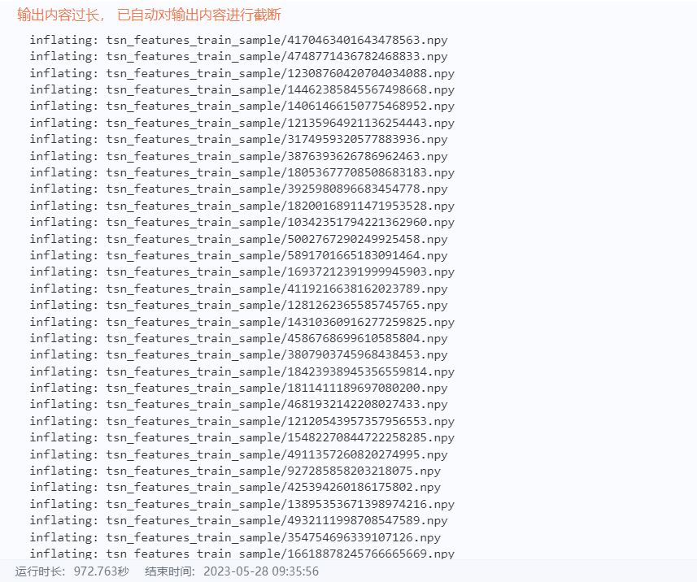 |
| 3    | **准备label集合** | 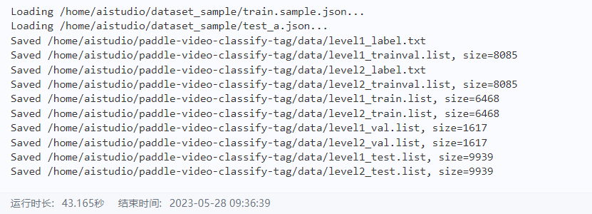 |
| 4    | **训练和验证分类模型** | 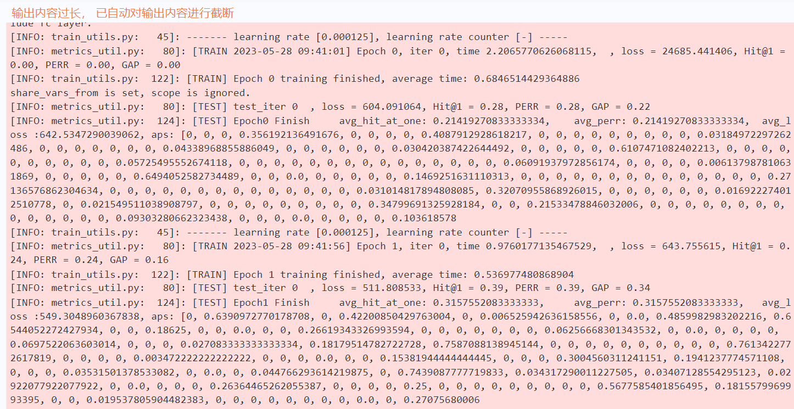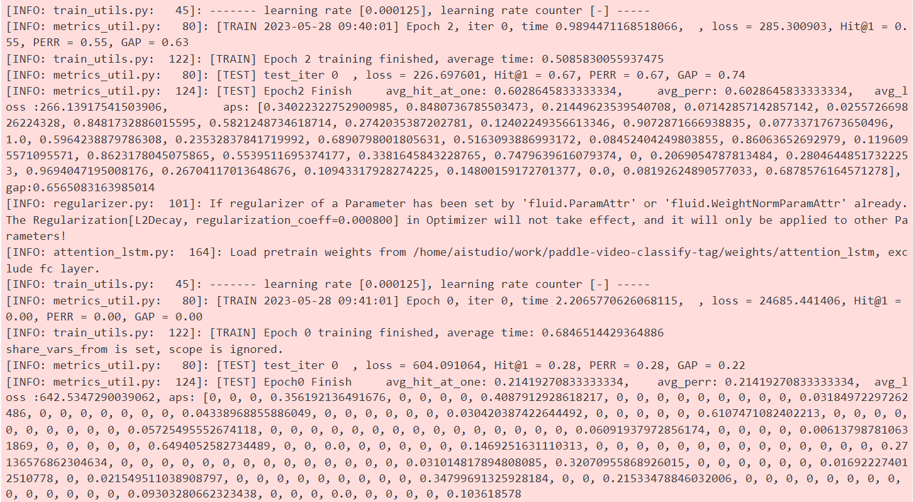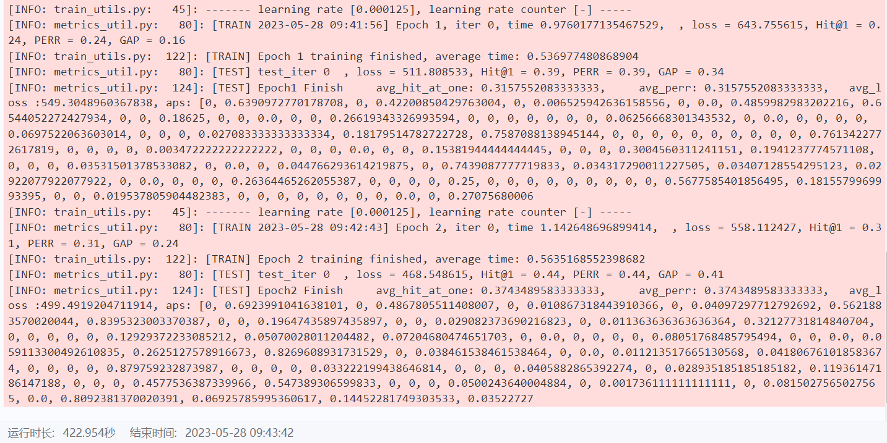 |
| 5    | **生成标签预测结果** | 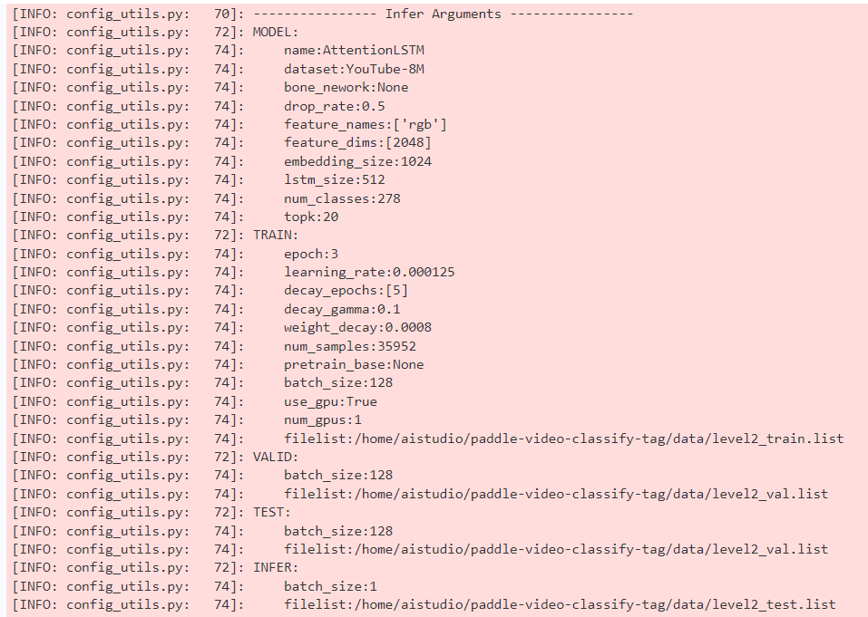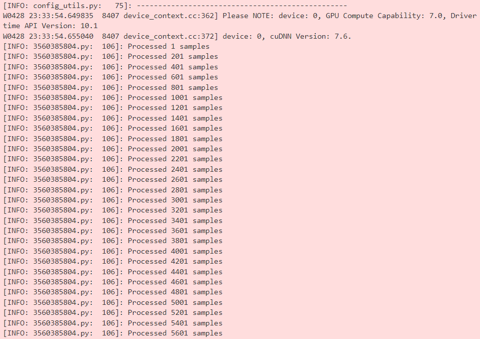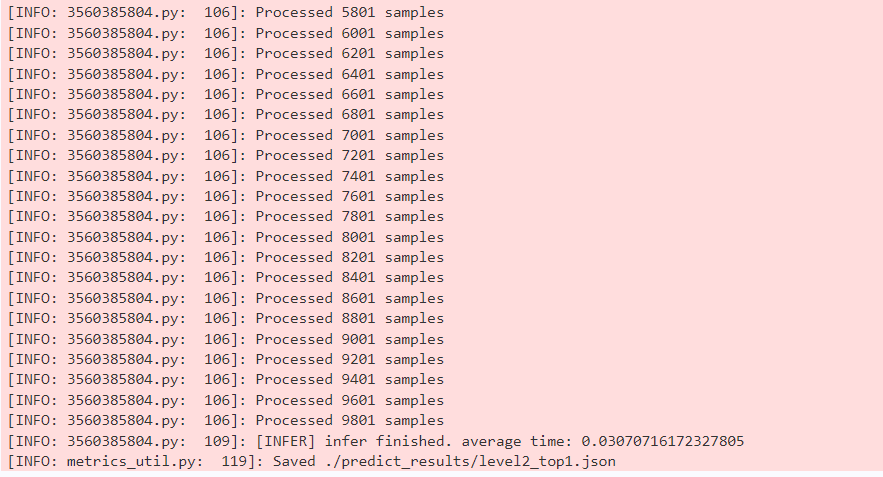 |
| 6    | **数据处理** | 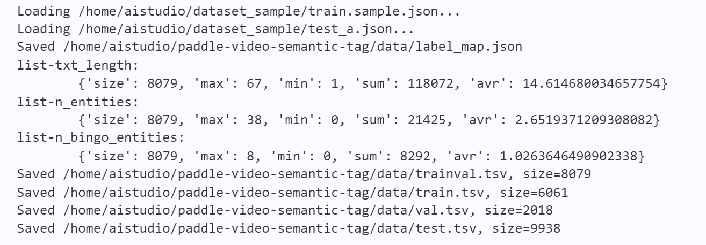 |
| 7    | **训练与验证** | 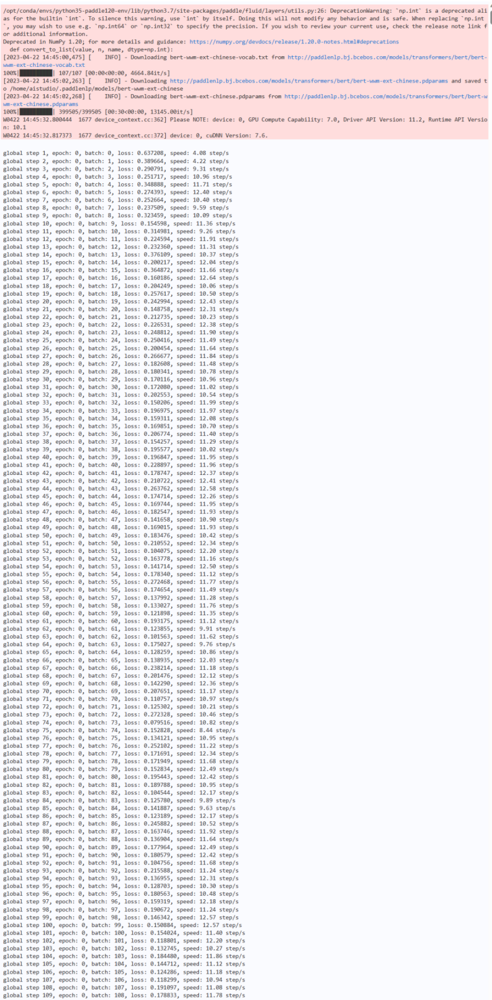 |
| 8 | **生成语义标签结果** | 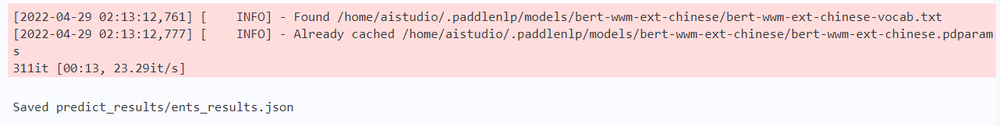 |
| 9 | **结果文件生成和提交** | 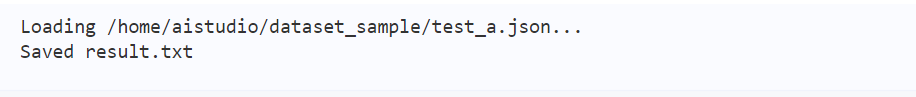 |
